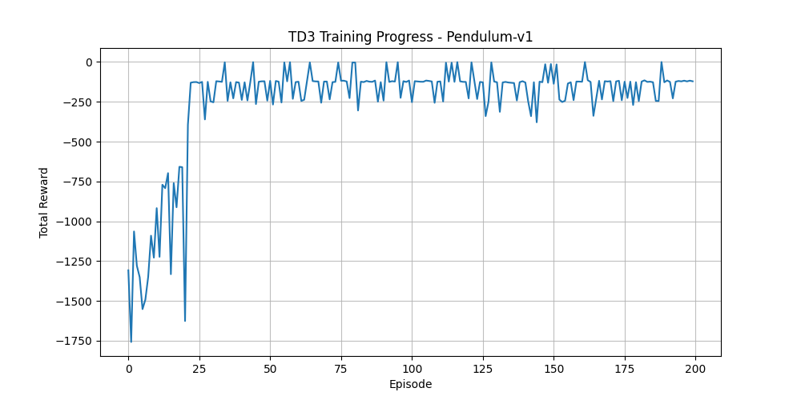

# TD3 Implementation for Pendulum-v1

A complete implementation of the Twin Delayed Deep Deterministic Policy Gradient (TD3) algorithm for the Pendulum-v1 environment using PyTorch.


<p align="center">
  
</p>


## Installation

```bash
source venv/bin/activate
pip install -r requirements.txt
```

## Usage

### Training

```bash
python main.py train
```

Trains the TD3 agent for 200 episodes and saves the model.

### Testing

```bash
python main.py test
```

Loads the trained model and runs 10 test episodes with rendering.

### Recording GIF

```bash
python main.py gif
```

Records a 5-second GIF of the pendulum in action using the trained model.

### CLI Options

#### Training Options
```bash
# Basic training
python main.py train

# Custom training parameters
python main.py train --max-episodes 500 --batch-size 64 --learning-rate 1e-4

# Full parameter customization
python main.py train \
    --max-episodes 300 \
    --batch-size 128 \
    --discount 0.99 \
    --tau 0.005 \
    --policy-noise 0.2 \
    --noise-clip 0.5 \
    --policy-freq 2 \
    --exploration-noise 0.1 \
    --learning-rate 3e-4 \
    --model-name my_td3_model
```

#### Testing Options
```bash
# Basic testing
python main.py test

# Custom test parameters
python main.py test --episodes 20 --model my_model

# Test without rendering (faster)
python main.py test --no-render --episodes 50

# Custom episode length
python main.py test --max-steps 1000
```

#### GIF Recording Options
```bash
# Basic GIF recording (5 seconds)
python main.py gif

# Custom duration and output
python main.py gif --duration 10 --output my_pendulum.gif

# Use different model
python main.py gif --model my_td3_model --output custom_pendulum.gif
```

### Monitoring

```bash
tensorboard --logdir runs/
```

## Details

### Info
- **Twin Critics**: Reduces overestimation bias in Q-learning
- **Delayed Policy Updates**: Updates actor less frequently than critics
- **Target Policy Smoothing**: Adds noise to target actions for regularization
- **Clipped Double Q-learning**: Uses minimum of two Q-values for targets

#### Actor Network
```
μ(s) = tanh(W₃ · ReLU(W₂ · ReLU(W₁ · s + b₁) + b₂) + b₃) × max_action
```

#### Critic Networks
```
Q₁(s, a) = W₃ · ReLU(W₂ · ReLU(W₁ · [s; a] + b₁) + b₂) + b₃
Q₂(s, a) = W₃' · ReLU(W₂' · ReLU(W₁' · [s; a] + b₁') + b₂') + b₃'
```

#### Target Policy Smoothing
```
ã = μ'(s') + ε, where ε ~ N(0, σ²)
ã = clip(ã, -max_action, max_action)
```

#### Clipped Double Q-Learning
```
Q_target = r + γ · min(Q₁'(s', ã), Q₂'(s', ã))
```

#### Delayed Policy Updates
```
L_actor = -E[Q₁(s, μ(s))]
```

#### Soft Target Updates
```
θ' ← τθ + (1 - τ)θ'
```

## References

- Fujimoto, S., van Hoof, H., & Meger, D. (2018). [Addressing Function Approximation Error in Actor-Critic Methods](https://arxiv.org/abs/1802.09477). ICML 2018.
```

</rewritten_file>